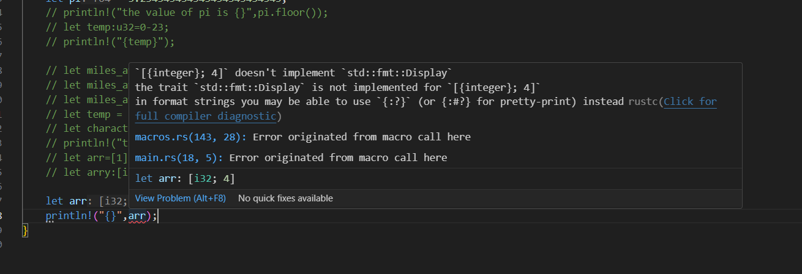

## **SECTION3 (DATA TYPES)**

1. Rust is a statically typed language, which means the compiler must know the types of all variables at compilation.
2. The compiler can infer the types of variables based on their initial assignments unlike C++ where the datatypes are explicitly mentioned by the programmer.
3. Signed integer types support positive and negative values. They start with an i (integer).
4. Unsigned integer types only support zero and positive values. They can store a larger max value in the positive direction. They start with a u (unsigned).
5. f32 has 6-9 digits of precision.
6. f64 has 15-17 digits of precision (number of digits after decimal).

# Integers
1. ```bash
     let eight_bit=-112;
     ```
     By default, it will be inferred as i32 but if you want to store it as an 8-bit integer then manually type the datatype.
2. ```bash
     let eight_bit:i8=-112;
     ```
3. If we assign a value that is not in range of i8 then the compiler will produce errors.
4. To declare unsigned:
     ```bash
     let eight_bit_unsigned:u8=255;
     ```
5. There is an alternate syntax if you do not want to declare the variable type after the variable:
     ```bash
     let eight_bit_signed=-23i8;
     ```
6. Btw what I observed is that:
     ```bash
     var:u32=-34;
     ```
     gives error but:
     ```bash
     var:u32=0-34;
     ```
     won't give errors during cargo check (compile time) but when you do cargo run, you will see an overflow error because the 0-34=-34 will be determined at runtime.

# _ as visual separator
1. To improve the readability of numbers.
2. ```bash
     let sixteen_bit_signed:i16=6_132_500;
     ```
     We can place the _ wherever we want, it's kind of insignificant to the compiler.

# usize and isize
1. i32 uses 32 bits of memory no matter what kind of architecture the system has.
2. usize and isize are aliases for existing datatypes.
3. ```bash
     let days:usize=33;
     ```
     If the system is 32-bit then it will be u32 and if the system is 64-bit then it will be u64.
4. Same for isize.
5. It helps us to write code that can be operated on different systems.

# Strings and raw strings
1. String literals are strings whose values the compiler knows at compile time.
2. Within "" we can include special characters like `\n` and `\"` ...consider `\` as an escape character.

# Intro to Methods
1. A method is a function that lives on a value. It's an action we can ask the value to execute.
2. ```bash
     value.method()
     ```
3. ```bash
     let value: i32=-15;
     println!("{}",value.abs());
     ```
4. ```bash
     let empty_space="    my content    ";
     ```
5. To remove the white spaces on both ends, we invoke .trim on this empty_space:
     ```bash
     println!("{}",empty_space.trim());
     ```
6. ```bash
     println!("{}",value.pow(2));
     ```
     i.e value^2

# Floating point types
1. ```bash
     let pi:f32 = 3.133333333333333333333333;
     println("The value of pi is {pi}");
     ```
2. You won't see the entire decimal because the precision of f64 is 16 bits.
3. NOTE: when you call methods on float variables, make sure that those variables are explicitly defined as f32 or f64.
4. ```bash
     var =34; println({},var.floor());
     ```
     will produce error but:
     ```bash
     var:f32=34; println({},var.floor());
     ```
     doesn't.

# Formatting floats with format specifier
1. Whenever we interpolate dynamic value inside {} of println, we can add a colon symbol to create a format specifier.
2. A format specifier customizes the printed representation of the interpolated value.
3. ```bash
     let pi=3.334343434343434;
     println!("the value of pi is {pi:.2}");
     ```
     or
4. ```bash
     println("the value of pi is {pi:.2}");
     ```

# Casting types with the as keyword
1. Casting refers to changing the datatype of a value.
2. ```bash
     let miles_away=50;
     let miles_away_i8=miles_away as i8;
     ```
3. You can completely change the datatype.
4. Ex:
     ```bash
     let miles_away=100.34343434;
     let miles_away_int=miles_away as i32;
     ```
5. In the above example, I will be losing the precision but the conversion is still totally valid.

# Math operations
1. Just like C++, `/` is a floor division.
2. Decimal division would give us decimal.
3. In Rust, you cannot do integer/decimal.

# Augmented Assignment Operator
1. Rust does not support post-increment operator.

# Booleans in Rust
1. ```bash
     let var=true;
     ```
2. ```bash
     let is_young=age < 35;
     ```
     is_young will be of type bool.
3. Methods on integers that will produce boolean values are age.is_positive(), age.is_negative().
4. `!` will flip/invert a boolean.

# Equality and Inequality operators
1. ```bash
     println("{}","Coke"=="coke");
     ```
     which gives us false.
2. `!=` is the inequality operator.
3. You cannot compare two different datatypes.
4. ```bash
     13==13.0
     ```
     will produce error. Instead do:
     ```bash
     13==13.0 as i32;
     ```

# && and ||
1. Unlike C++, "and" && "or" keywords cannot be used for logical conjunction. Only the symbols are valid.

# Character type
1. A character represents a single Unicode.
2. Unicode is a computing standard for the representation of text for most of the world's writing systems.
3. Unicode supports alphabets, emojis, and various other symbols.
4. UTF - Unicode Transformation Format.
5. In Rust, a character type occupies 4 bytes 😲 (the reason for that is to support various other symbols rather than just ASCII values).
     i.e it has the capacity to store any UTF8 character.
6. ```bash
     let character='B';
     ```

# The Array Type
1. ```bash
     let numbers = [4,5,6,7,8,9];
     ```
2. ```bash
     let apples=["hello","1index","2index"];
     ```
3. Just like C, C++ array in Rust has to be homogenous data unlike list in Python.
4. ```bash
     array.len();
     ```
     returns the length of the array.
5. Rust figures out the space/type by looking at the values, if you don't manually enter the datatype and leave the array empty then it will throw errors. Ex:
     ```bash
     let arr=[];
     ```
6. If you write:
     ```bash
     let arr:[i32;0]=[];
     ```
     then this won't throw any errors.

# Reading and Writing array elements
1. Just like C++, you can access the element using arr[idx] and you can also modify the array if it is mut.
2. It also has out of the bound errors.

# The Display Trait
1. A contract is a document that people sign that states their obligations.
2. A trait is like a contract that requires that a type support one or more methods.
3. Traits establish consistency between types; methods that represent the same behavior have the same name.
4. When a type opts in to honoring a trait's requirements, we say the type implements the trait.
5. Types can vary in their implementations but still implement the same trait.
6. A type can choose to opt in to implementing a trait.
7. A type can implement multiple traits. There are hundreds of traits available in Rust.
8. A trait is called an interface or protocol in other programming languages.
     Ex: Display Trait
     1. The display trait requires that a type can be represented as a user-friendly, readable string.
     2. The display trait mandates a format method that returns the string representation of that datatype.
     3. When we use the {} interpolation syntax, Rust relies on the format method.
     4. Integers, floats, and booleans all implement the Display trait so we are able to interpolate them with curly braces.
     5. It is not always clear how a complex type should be represented as a piece of text. Not all types implement the Display trait. One example is the array type.
     6. ```bash
          let arr=[1,2,3];
          println!("{}",arr);
          ```
          will produce error because the array type doesn't implement std::fmt::Display trait.
     7. 
     8. Then how do we print out the array?
     9. Looks like there is another way i.e **Debug Traits**
# The Debug Trait

1. Goal of this trait is to format the given type into programmer facing string for the purposes of debugging.
2. Intended more for developer unlike display trait which is meant for user.
3. Array types do implement the debug trait that allows us to output the string version of the array to screen.
4. ```bash
     println!("{:?}",array);
     ```
     or
   ```bash
   println!("{array:?}");
     ```
     where : is the format specifier (similar to the one used in float format specifier like   `:.2`)
      ? calls the format method mandated by debug trait 
5. Simply put,`{}` is to provide the spot  for dynamic content and `:`(format specifier) to ask rust to customize how that data is going to look.
6. there is also `#?` which pretty prints the debugging information.
7. ```bash
      println!("{array:#?}");
   ```

8. sfsrfg


# The dbg! Macro
1. 
2. behind the scenes,rust replaces the macro code during compilation with valid function calls.
3. 
4. Its gonna show us the filename ie where the macro was used,the line number,number of spaces into the line and the exact code we wrote and the resulting value.The argument that we pass to this macro must implement debug trait.


# The tuple type
1. A tuple need not be homogenous.
2. we create tuple with a pair of paranthesis.
3. ```bash
     let employee=("Molly",32,"Marketing");
     let name=employee.0;
     let age=employee.1;
     println!("{employee:?}");
   ```
   or 
   ```bash
     let employee=("Molly",32,"Marketing");
     let (name,age,department)=employee;
   ```
4. 
5. The tuple doesn't implement display trait like an array but it does implement debug trait
   

# Ranges and Ranges Iteration
1. A range is a sequence/interval of consecutive values.
2. 


# Intro to Generics

1. In the earlier subsection we had Range<int> and Range<char>.
2. A generic is a type argument.
3. It is a kind of type data is being passed.
4. It places a placeholder for the future actual type.
5. 
6. This subsection is all about saying that even in future if new data types come ie Range<newtype>,the code/modules in rust are such that they are written generic ie you can even pass these new ones.


