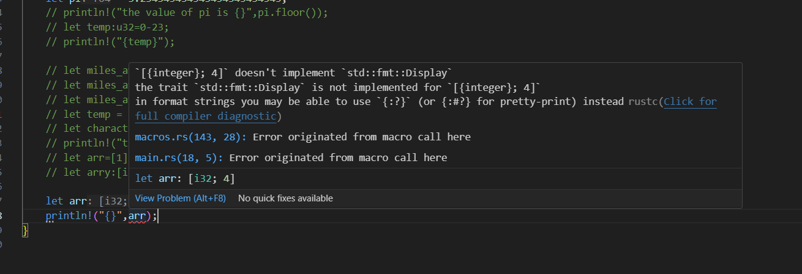

<!-- 1. Rust is a statically typed language,which means the compiler must know the types of all variables at compilation.
1. The compiler can infer the types of variables based on their initial assignments unlike c++ where the datatypes are explicitly mentioned by the programmer.
2. Signed integer types support positive and negative values.They start with an i(integer).
3. Unsigned integer types only support zero and positive values.They can store a larger max value in the positive direction.They start with an u(unsigned).
4. f32 has 6-9 digits of precision
5. f64 has 15-17 digits of precision(number of digits after decimal)
   

# Integers
1. `let eight_bit=-112;` ,by default it will be inferred as i32 but if you want to store it as 8bit integer then manually type the datatype.
2. `let eight_bit:i8=-112;` 
3. if we assign a value that is not in range of i8 then compiler will produce errors.
4. to declare unsigned `let eight_bit_unsigned:u8=255;`
5. There is an alternate syntax if you do not want to declare the variable type after the variable then:
       `let eight_bit_signed=-23i8;`
6. Btw what i observed is that `var:u32=-34;` gives error but `var:u32=0-34;` wont give errors during cargo check(compile time) but when u do cargo run..you will see overflow error because the 0-34=-34 will be determined at run time.

# _ as visual seperator.
1. to improve the readibility of numbers.
2. `let sixteen_bit_signed:i16=6_132_500`...we can place the _ wherever we want,its kind of insignificant to compiler.
   

# usize and isize
1. i32 uses 32 bits of memory no matter what kind of architecture the system has.
2. usize and isize are aliases for existing datatypes.
3. `let days:usize=33;`,if the system is 32-bit then it will be u32 and if the system is 64-bit then it will be u64.\
4. same for isize.
5. It helps us to write code that can be operated on different systems.

# Strings and raw strings
1. String literals are strings whose values the compiler knows at the compiler time.
2. within "" we can include special characters like `\n` and `\"` ...consider `\` as an escape character.

# Intro to Methods
1. A method is a function that lives on a value.Its an action we can ask the value to execute.
2. value.method()
3. ` let value: i32=-15;
     println!("{}",value.abs());`
4. `let empty_space="    my content    ";`
5. to remove the white spaces in both ends,we invoke .trim on this empty_space
6. `println!("{}",empty_space.trim());`
7. `println!("{}",value.pow(2));` i.e value^2

# Floating point types
1. `let pi:f32 = 3.133333333333333333333333;
2.   println("The value of pi is {pi}");`
3.   you wont see the entire decimal because the precision of f64 is 16 bits
4.   NOTE: when you call methods on float variables,make sure that those variables are explicitly defined as f32 or f64.
5.   i.e `var =34; println({},var.floor())` will produce error but `var:f32=34; println({},var.floo())` doesnt.
   

# Formatting floats with format specifier.
1. whenever we interpoloate dynamic value inside {} of println,we can add a colon symbol to create a format specifier.
2. A format specifier customizes the printed representation of the interpolated value.
3. `let pi=3.334343434343434;`
4. `println!("tthe value of pi is {pi:.2}")`..print the pi with 2 digits precision.
                      or
5. `println~("the value of pi is {.:2}",pi);` .
   

# Casting types with the as keyword
1. Casting refers to changing the datatype of a value.
2. `let miles_away=50;
3.  let miles_away_i8=miles_away as i8;`
4.  You can completely change the datatype.
5.  Ex: `let miles_away=100.34343434; let miles_away_int=miles_away as i32;`
6.  In the above example,i will be loosing the precision but the conversion is still totally valid..
7.  

# Math operations
1. just like c++,`/` is a floor division.
2. decimal division would give us decimal.
3. In rust,you cannot do integer/decimal.

# Augmented Assignment Operator
1. Rust does not support post increment operator.

# Booleans in Rust
1. let var=true;
2. `let is_young=age < 35;`,is_young will be of type bool.
3. Methods on integers that will produce boolean values are age.is_positive(),age.is_negative();
4. `!` will flip/invert a boolean.

# Equality and Inequality operators.
1. `println("{}","Coke"=="coke");` which gives us false.
2. `!=` is the inequality operator.
3. you cannot compare two different dataypes.
4. `13==13.0` will produce error.Instead do `13==13.0 as i32`
   
# && and ||
1. unlike c++,"and" && "or" keywords cannot be used for logical conjunction.Only the symbols are valid.

# Character type
1. A character represents a single unicode.
2. Unicode is a computing standard for the representation of text for most of the world's writing systems.
3. Unicode supports alphabets,emojis and various other symbols.
4. UTF-Unicode tranformation format.
5. In rust, a character type occupies 4Bytes😲(the reason for that is to support various other symbols rather than just ASCII values).
   i.e it has the capacity store any UTF8 character.
6. `let character='B';`
   

# The Array Type
1. `let numbers = [4,5,6,7,8,9];`
2. `let apples=["hello","1index","2index"];`
3. Just like c,c++ array in rust has to be homogenous data unlike list in python.
4. `array.len();` returns the length of the array.
5. Rust figures out the space/type by looking at the values ,if you don't manually enter the dataype and leave the array empty then it will throw errors. Ex: `let arr=[];`    
6. if you write `let arr:[i32;0]=[];`,then this wont throw any errors.

# Readin and Writing array elements.
1.  Just like c++,you can access the element using arr[idx] and you can also modify the array if it is mut.
2.  It also has out of the bound errors.
3.  

# The Display Trait
1. A contract is a document that people sign that states their obligations.
2. A trait is like a contract that requires that a type support one or more methods.
3. Traits establish consistency between types;methods that represent the same behavior have the same name.
4. When a tyope opts in to honoring a trait's requirements,we say the type implements the trait.
5. Types can vary in their implementatios but still implement the same trait.
6. A type can choose to opting in to implementing a trait.
7. A type can implement multiple traits.There are hundreds of traits available in Rust.
8. A trait is called an interface or porotocol in other programming languages.
   Ex: Display Trait
   1. The display trait requires that a type can be represente as a user-friendly,readable string.
   2. The display trait mandates a format method that returns the string representation of that datatype.
   3. when we use the {} interpolation syntax,Rust relies on the format method.
   4. Integers,floats, and booleans all implement the Display trait so we are able to interpolate them with curly braces.
   5. It is not always clear how a complex type should be represented as a piece of text.\Not all types implement the Display trait.One example is the array type.
   6. `let arr=[1,2,3];  println!("{}",arr);` will produce error because the array type doesn't implement std::fmt::Display trait.
   7. 
   8. Then how do we printout the array?
   9. Looks like there is another way ie **Debug Traits**
 -->
