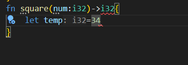
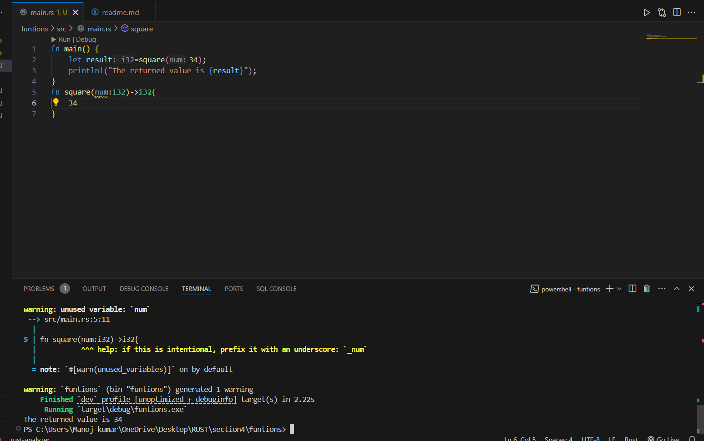

# Functions

## Paramters and Arguments
1. to declare parameter,name and type has to be mentioned.
2. ```bash
    fn open_store(neighbourhood:&str,random:i32){

        println!("Opening my store in {}");
    }
    ```

## Explicit Return values
1. Inorder to declare the return value,we need to add the return keyword.
2. If i am returning something ,I also have to mention the type of the returned value in the function signature.
3. ```bash
    let result=square(34);

    fn square(number:i32)->i32{
        return number*number;
    }

    ```
## Implicit Return values.
1. return keyword will explicitly tell what the returned value is.
2. A function will implicitly returns the last line it evaluates.
3. ```bash
    fn square(number:i32)->i32{
        number*number
    }
    ```

4. See that semi colon should not be kept at the last line.
5. 
6. 

## The unit as a return type
1. A unit is an empty typles,a tuple without values.
2. 